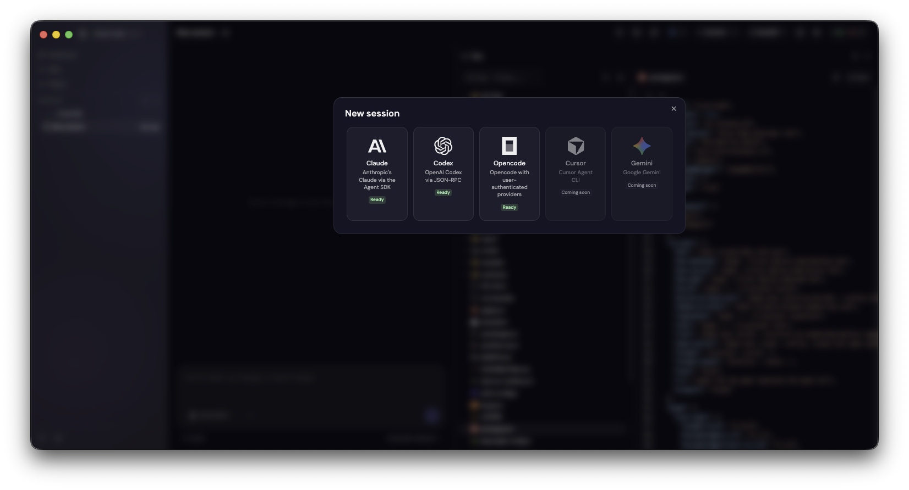
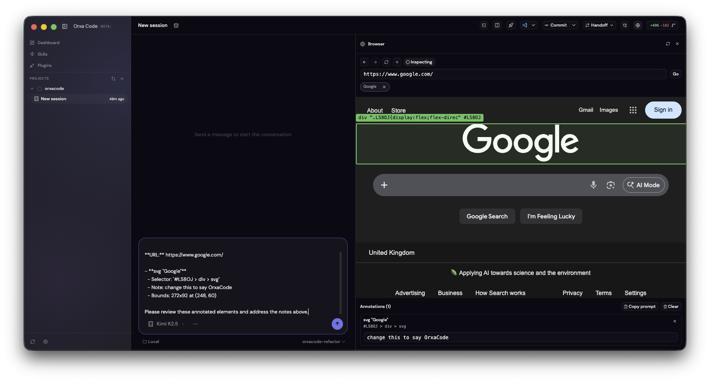
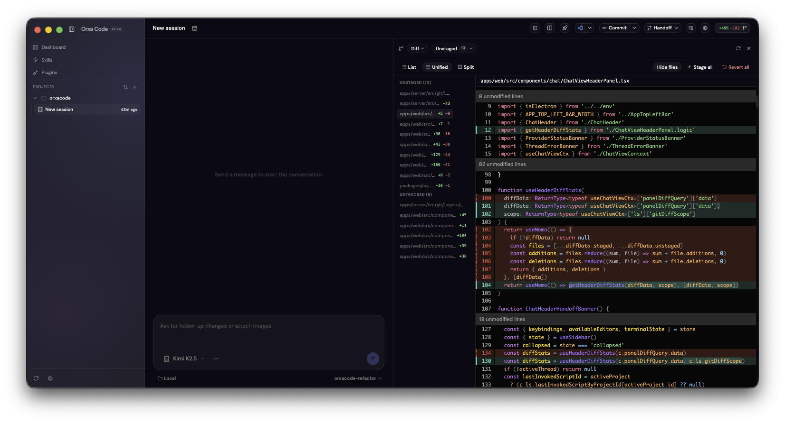
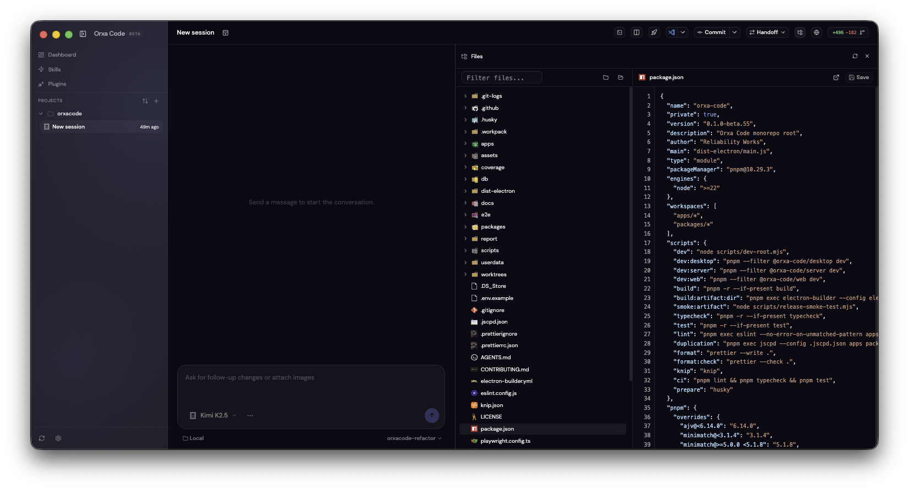

# Orxa Code

Orxa Code is a desktop workspace for AI coding threads. Start a Claude, Codex, or Opencode session, then keep the browser, files, git review, and terminal tools beside the same thread instead of bouncing between separate apps.



## Download

Get the latest build from the [Releases page](https://github.com/Reliability-Works/orxacode/releases).

The published build is currently a macOS beta.

## Supported providers

You need at least one provider installed locally.

| Provider | Install                                           | Notes                                                       |
| -------- | ------------------------------------------------- | ----------------------------------------------------------- |
| Claude   | `curl -fsSL https://claude.ai/install.sh \| bash` | Uses the local Claude Agent SDK and CLI wiring in Orxa Code |
| Codex    | `npm install -g @openai/codex`                    | Runs through the Codex app-server JSON-RPC flow             |
| Opencode | `npm install -g opencode-ai`                      | Uses your authenticated Opencode setup                      |

The session picker only enables providers that are ready on your machine. Cursor is shown as unavailable today, and Gemini is marked as coming soon.

## What you can do in a thread

- Start provider-specific threads from the same project sidebar
- Hand work between providers when you want a different model or tool stack
- Open browser, files, and git sidebars beside the active thread
- Keep a thread-scoped terminal drawer open under the chat
- Review approvals, plans, diffs, and command output in one shared timeline
- Jump out to top-level Dashboard, Skills, and Plugins views without leaving the app

## Browser annotations

The browser sidebar is built into the chat workspace. Open a tab, switch on inspect mode, click elements, add notes, and copy the result as a prompt you can send straight back into the thread.



## Git review and commit flow

The git sidebar is more than a raw diff viewer. You can switch between diff, log, issues, and pull request views, change diff scope, and keep the thread pointed at the exact repo state you are reviewing.



## Built-in file tree and editor

The files sidebar lets you browse the project tree, open files, and inspect or edit them without leaving the current thread.



## Documentation

Docs live in [`docs/`](docs/):

- [Architecture](docs/architecture.md)
- [Browser Sidebar](docs/browser.md)
- [Chat Workspace](docs/chat-ui.md)
- [Providers and Threads](docs/sessions.md)
- [Settings](docs/settings.md)
- [Appearance](docs/theming.md)
- [Troubleshooting](docs/troubleshooting.md)
- [Upstream References](docs/upstream-references.md)

## Development

```bash
pnpm install
pnpm dev
```

```bash
pnpm lint
pnpm typecheck
pnpm test
pnpm build
pnpm smoke:artifact
```

## Contributing

Read [CONTRIBUTING.md](CONTRIBUTING.md) before opening a pull request.

## License

[MIT](LICENSE)
