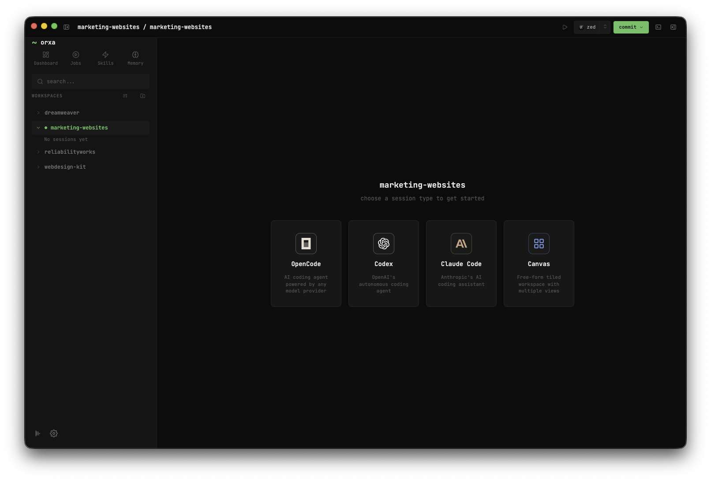
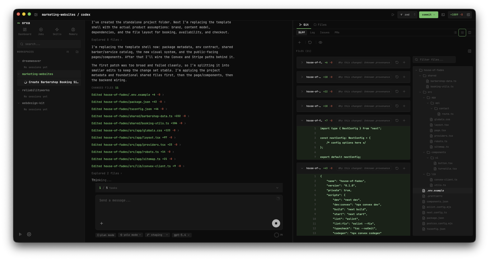
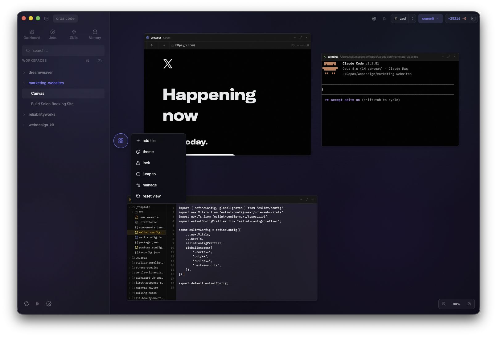
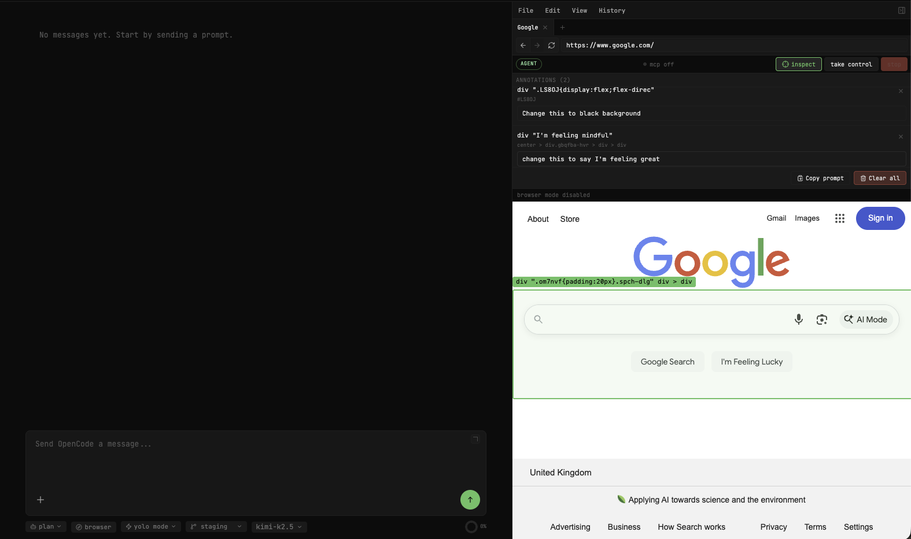

# Orxa Code

A desktop app for working with AI coding agents. Bring your own backend — OpenCode, Codex, or Claude Code — and run them side by side in one workspace.



## Download

Grab the latest build from the [Releases page](https://github.com/Reliability-Works/orxa-code/releases).

Currently shipping **macOS-only** (`dmg`, `zip`). Windows and Linux builds exist in the repo but aren't published yet — we want to run them properly before putting them out.

## Requirements

You need **at least one** of these AI backends installed:

| Backend                                              | Install                                           | What you get                                                                   |
| ---------------------------------------------------- | ------------------------------------------------- | ------------------------------------------------------------------------------ |
| [OpenCode](https://github.com/anomalyco/opencode)    | `npm install -g opencode-ai`                      | Full agent sessions — tool use, file editing, terminal access                  |
| [Codex](https://github.com/openai/codex)             | `npm install -g @openai/codex`                    | Agent sessions with plan mode, collaboration modes, subagents                  |
| [Claude Code](https://code.claude.com/docs/en/setup) | `curl -fsSL https://claude.ai/install.sh \| bash` | Claude Code (Chat) with shared UI and subagents, plus Claude Code (Terminal)   |

All session types stay available in the picker. If a backend isn't installed, the session shows an error with setup instructions instead of disappearing.

## Features

### Chat & agents

- **Multiple providers in one place** — start OpenCode, Codex, Claude Code (Chat), or Claude Code (Terminal) sessions from the sidebar and switch between them freely
- **Consistent UI across structured chat providers** — OpenCode, Codex, and Claude Code (Chat) all render through the same shared message components: tool call cards, inline diffs, command output, streaming indicators
- **Docks above the composer** — plan progress, agent questions, permission requests, follow-up suggestions, and queued messages all surface as floating panels above the input area
- **Message queue** — keep typing while the agent works; messages queue up and send automatically when it finishes
- **Plan mode** — Codex and Claude Code (Chat) can switch into planning before doing any work
- **Background agents** — Codex and Claude Code (Chat) can delegate tasks to subagents that run independently and report back

### Claude Code modes

- **Claude Code (Chat)** — structured chat UI with Claude models, traits, plan mode, permissions, and background agents in the shared dock
- **Claude Code (Terminal)** — the raw Claude Code CLI terminal for users who want the native terminal workflow inside Orxa Code



### Canvas

A tiled workspace where you arrange terminals, browsers, file editors, markdown previews, and more on an infinite pannable canvas.

- **Customisable backgrounds** — nine gradient presets (glass, frost, aurora, etc.), hex colour picker, or upload your own image
- **Jump to** — quickly locate any tile on the canvas from the toolbar dropdown
- **Tile management** — duplicate or remove tiles from the manage menu
- **Snap-to-grid** — lock tiles to a grid for clean layouts



### Integrated browser

A multi-tab Chromium browser in its own dedicated sidebar with agent automation, a persistent browsing profile, and element inspection.

- **Browser menu bar** — File, Edit, View, History menus with real actions (new tab, close tab, copy/paste URL, reload, navigation history)
- **Agent control** — hand browser control to the AI agent or take it back at any time
- **Inspect mode** — click elements on the page to annotate them with notes, then copy a structured prompt to your clipboard



The copied prompt includes the page URL, element selectors, your notes, and bounding boxes — ready to paste into any AI agent:

```
## Browser Annotations

**URL:** https://www.google.com/

- **div ".LS8OJ{display:flex;flex-direc"**
  - Selector: `#LS8OJ`
  - Note: Change this to black background
  - Bounds: 689x226 at (0, 60)

- **div "I'm feeling mindful"**
  - Selector: `center > div.gbqfba-hvr > div > div`
  - Note: change this to say I'm feeling great
  - Bounds: 147x34 at (345, 260)

Please review these annotated elements and address the notes above.
```

### Workspace tools

- **Git sidebar** — diffs, commit flow, and branch management in the right panel
- **Jobs** — schedule and monitor recurring tasks from the sidebar
- **Skills** — browse and use agent skills
- **Settings drawer** — per-provider configuration, model selection, permission modes
- **Desktop notifications** — get alerted when the agent needs input or finishes a task
- **Auto-updates** — stable and prerelease channels, with an update card in the sidebar when a new version is available

## Documentation

Docs live in [`docs/`](docs/):

- [Architecture](docs/architecture.md) — process model, IPC, event flow
- [Session types](docs/sessions.md) — OpenCode, Codex, Claude Code (Chat), Claude Code (Terminal), Canvas
- [Chat UI](docs/chat-ui.md) — message components, docks, message queue
- [Browser integration](docs/browser.md) — agent automation, control handoff, annotations
- [Settings](docs/settings.md) — per-provider configuration reference
- [Troubleshooting](docs/troubleshooting.md) — common issues and fixes

## Development

```bash
pnpm install
pnpm dev
```

```bash
pnpm lint        # eslint
pnpm typecheck   # tsc -b
pnpm test        # vitest
pnpm dist        # package for distribution
```

## License

[MIT](LICENSE)
