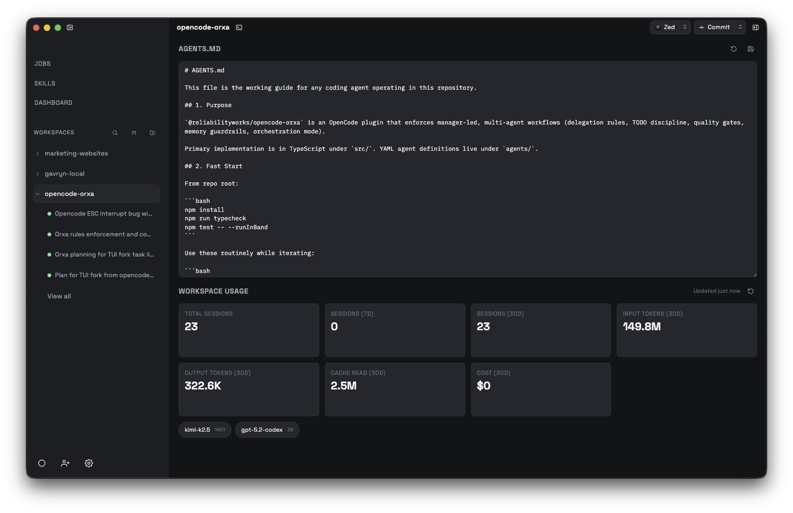
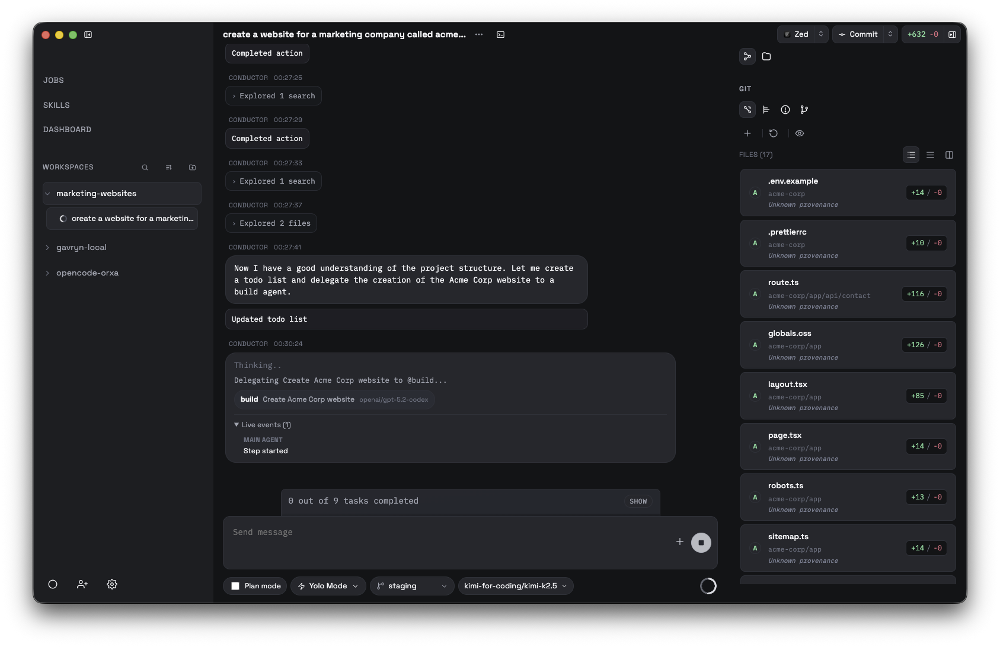
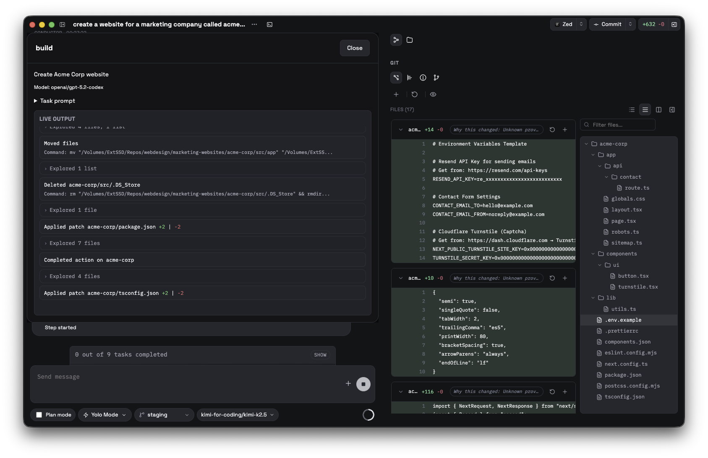
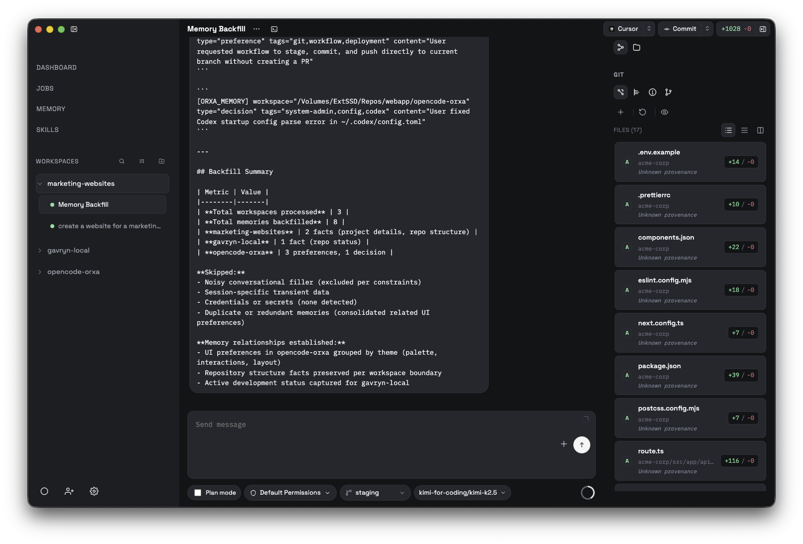
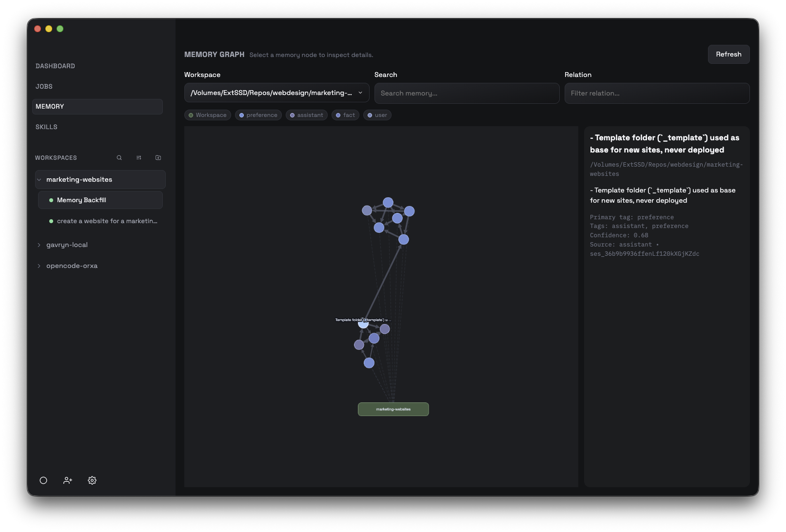

# Opencode Orxa



## Table of Contents

- [At a Glance](#at-a-glance)
- [UI Preview](#ui-preview)
- [Runtime Requirements](#runtime-requirements)
  - [Required: OpenCode](#required-opencode)
  - [Optional: Orxa Package (for Orxa mode)](#optional-orxa-package-for-orxa-mode)
- [Feature Breakdown](#feature-breakdown)
  - [Workspace Operations](#workspace-operations)
  - [Sessions and Message Feed](#sessions-and-message-feed)
  - [Memory System](#memory-system)
  - [Permission and Safety UX](#permission-and-safety-ux)
  - [Skills and Prompt Preparation](#skills-and-prompt-preparation)
  - [Integrated Browser and Agent Control](#integrated-browser-and-agent-control)
  - [Jobs and Automation](#jobs-and-automation)
  - [Runtime, Terminal, and Config](#runtime-terminal-and-config)
  - [Plugin and Updater Support](#plugin-and-updater-support)
- [Agent Browser Contract](#agent-browser-contract)
- [Local Development](#local-development)
- [Validation](#validation)
- [Packaging](#packaging)
- [Auto Updates](#auto-updates)
- [Architecture + Troubleshooting](#architecture--troubleshooting)
- [Notes](#notes)

## UI Preview

Main session view:



Subagent live output with unified diff:



Memory backfill prompt workflow:


[Open full-size: memory backfill prompt workflow](assets/readme/backfill-memory.png)

Memory graph with workspace hub and typed memory nodes:


[Open full-size: memory graph with typed nodes](assets/readme/orxa-memory.png)

Opencode Orxa is an Electron desktop app for operating OpenCode workspaces with a local-first, multi-project interface.

Powered by OpenCode and the `@opencode-ai/sdk` ecosystem.
Source of truth: [anomalyco/opencode](https://github.com/anomalyco/opencode).

Quick links:
- Contribution guide: [`contributor.md`](contributor.md)
- License: [`LICENSE`](LICENSE)

## At a Glance

Opencode Orxa ships as a full workspace operations desktop for OpenCode with:

- Multi-workspace management and session-first execution timeline.
- Rich model/agent composition with session controls and permission mode switching.
- Integrated memory capture/retrieval with graph visualization.
- Embedded real browser (persistent profile, tabs, history, login/session persistence).
- Agent browser automation bridge (action envelope contract and machine result loopback).
- Job scheduler with per-job Browser Mode toggle for browser-enabled automation runs.
- Integrated terminal, runtime profile management, plugin bootstrap, and auto updates.

## Runtime Requirements

### Required: OpenCode

- Repository: [anomalyco/opencode](https://github.com/anomalyco/opencode)
- Why required: Opencode Orxa depends on the OpenCode CLI/server runtime for sessions, tools, and streaming.
- Install command:

```bash
npm install -g opencode-ai
```

### Optional: Orxa Package (for Orxa mode)

- Repository: [Reliability-Works/opencode-orxa](https://github.com/Reliability-Works/opencode-orxa)
- Why optional: needed only for Orxa mode workflows, templates, and agent assets.
- Install command:

```bash
npm install -g @reliabilityworks/opencode-orxa
```

On startup, the app runs a dependency check and shows an install helper modal if either dependency is missing.

## Feature Breakdown

### Workspace Operations

- Multi-workspace sidebar with per-project session grouping.
- Workspace dashboard with high-level project metrics and operational state.
- One-click add/select workspace flow with active-workspace context preserved across views.

### Sessions and Message Feed

- Session-first workflow with prompt composer and live response streaming.
- Structured timeline rendering for reads/searches/edits/runs so execution activity is traceable.
- Subagent delegation bubbles with a dedicated live-output modal for delegated tasks.
- In-feed system notices for explicit stop/error states and recovery guidance.

### Memory System

- Local-first, bundled memory subsystem stored in-app (no external hosted memory API required).
- Per-workspace retrieval isolation for session-time memory context.
- Memory graph view with workspace hubs, memory nodes, and relationship links.
- Tag-based node coloring for quick visual parsing of memory types.

How it is used:

1. Backfill historical memories:
   - Open `Memory` in the sidebar.
   - Click `Prepare Backfill Session`.
   - The app creates a new prefilled session prompt containing workspace context.
   - Select model/agent as normal and press `Send`.
   - The app ingests structured memory lines into local memory and updates the graph.
2. Ongoing sessions:
   - When memory is enabled, the app retrieves relevant memory for the current workspace during prompt assembly.
   - The app can proactively capture new durable memories from session history and append relationships.
   - Retrieval remains scoped to the active workspace even when graph visualization spans multiple workspaces.

Memory controls are available in Settings:

- Global enable/disable.
- Workspace override.
- Guidance for proactive memory capture.
- Template import (Conservative, Balanced, Aggressive, Codebase Facts).

### Permission and Safety UX

- Runtime permission prompts for tool actions requiring approval.
- Mid-session permission mode switching (`Default Permissions` / `Yolo Mode`).
- Visible session-state indicator when a session is waiting for permission input.

### Skills and Prompt Preparation

- Built-in skill discovery from local OpenCode skill directories.
- Skill modal for choosing workspace target and preparing a structured seed prompt.
- Session targeting during prepare flow (current session or new session).

### Integrated Browser and Agent Control

- Embedded right-pane browser tab beside `Git` and `Files`, including:
  - Multi-tab browsing.
  - URL navigation controls.
  - History list + clear history actions.
  - Persistent browser profile (`persist:orxa-browser`) so cookies/session logins survive app restarts.
- Browser mode toggle in composer controls:
  - Off by default.
  - When on, prompts include explicit browser capability instructions.
- Human/agent control handoff:
  - Agent controls by default when Browser Mode is enabled.
  - `Take control` switches ownership to human and pauses agent execution.
  - `Hand back to agent` returns ownership for continued automation.
  - Browser strip `Stop` uses the same abort pathway as composer stop / `Esc`.
- Auto focus behavior:
  - App switches to the browser pane when agent browser actions begin.

### Jobs and Automation

- Job templates for common recurring workflows.
- Configurable schedules (daily with days/time, or interval-based).
- Job run inbox with completion/failure visibility and per-run output viewer.
- Per-job `Enable Browser Mode` toggle:
  - Disabled by default.
  - When enabled, scheduled runs receive browser capability instructions.
  - When disabled, no browser contract is injected for that job run.

### Runtime, Terminal, and Config

- Runtime profile management (attach existing server or run local runtime).
- Integrated terminal tabs via OpenCode PTY APIs.
- Config management:
  - guided UI for common fields
  - raw JSON/JSONC editor for project/global config
  - dedicated Orxa config and agent prompt editing

### Plugin and Updater Support

- Built-in Orxa plugin bootstrap/registration path in app flow.
- Auto-update checks for packaged builds via GitHub Releases.
- Manual update trigger in Settings and Help menu (`Check for updates`).

## Agent Browser Contract

When Browser Mode is enabled and the agent owns control:

1. Assistant emits:

```xml
<orxa_browser_action>{"id":"unique-action-id","action":"navigate","args":{"url":"https://example.com"}}</orxa_browser_action>
```

2. The app executes the action via browser IPC and returns a machine message prefixed with:

```text
[ORXA_BROWSER_RESULT]{"id":"unique-action-id","action":"navigate","ok":true,"data":{...}}
```

3. If browser mode is disabled or human owns control, execution is deterministically blocked and the result includes a blocked reason.

Supported actions include:
- `open_tab`, `close_tab`, `switch_tab`, `navigate`, `back`, `forward`, `reload`
- `click`, `type`, `press`, `scroll`, `extract_text`, `screenshot`
- `exists`, `visible`, `wait_for`, `wait_for_navigation`, `wait_for_idle`

Locator guidance for dynamic pages:
- Prefer robust locator args (`selector`, `selectors`, `text`, `role`, `name`, `label`, `frameSelector`).
- Use `timeoutMs` and `maxAttempts` for retries/waits.
- For dynamic or anti-automation pages, DOM primitives can still fail; design workflows to handle blocked/timeouts and retry with alternative locators.

## Local Development

```bash
pnpm install
pnpm dev
```

Mac dev icon sync variant:

```bash
pnpm dev:mac
```

## Validation

```bash
pnpm lint
pnpm typecheck
pnpm test
pnpm test:coverage
```

Coverage gate is enforced in CI for core shared logic (80% statements/functions/lines, 75% branches).

## Packaging

```bash
pnpm dist
```

Configured targets:

- macOS: `dmg`, `zip` (signed + notarized in CI)
- Windows: `nsis`, `zip`
- Linux: `AppImage`

## Auto Updates

Packaged builds check GitHub Releases periodically and prompt users when an update is available.

- Prompt 1: download update now or later
- Prompt 2: restart now to apply downloaded update or later

Notes:

- Auto-update runs only in packaged builds (`app.isPackaged`)
- Users can choose update channel in Settings:
  - `stable`: only stable tags (e.g. `v1.2.3`)
  - `prerelease`: includes prerelease tags (e.g. `v1.2.3-beta.1`)

## Architecture + Troubleshooting

- Architecture diagram: [`docs/architecture.md`](docs/architecture.md)
- Troubleshooting guide: [`docs/troubleshooting.md`](docs/troubleshooting.md)

## Notes

- This repository customizes UX, workflows, and operational defaults for Opencode Orxa.
- It is not the upstream OpenCode project; see the upstream repo link above.
