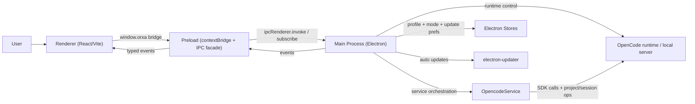

# Architecture

Opencode Orxa is an Electron app with a strict process split.

## Process boundaries

- `electron/main.ts`: BrowserWindow lifecycle, IPC handlers, runtime bridge, updater integration.
- `electron/preload.ts`: safe, typed API surface exposed as `window.orxa`.
- `src/*`: UI state and rendering only; no direct Node APIs.

## IPC contract

- Centralized in `shared/ipc.ts`.
- Renderer only talks through typed channels.
- High-risk inputs (`sendPrompt`, runtime profile save, config patch) are schema-validated in main.

## Runtime lifecycle

1. App starts, window created.
2. Main restores mode/profile state and optionally runs Orxa bootstrap.
3. Renderer boots and hydrates workspace/project/session state through IPC.
4. Event stream (`orxa:events`) pushes runtime, project, terminal, and updater telemetry updates.

## Update lifecycle

1. Main initializes updater controller (`electron/services/auto-updater.ts`).
2. Controller loads persisted preferences (`auto check`, `release channel`).
3. Scheduled or manual checks run via GitHub Releases metadata.
4. On update available: prompt to download.
5. On download complete: prompt to restart and install.
