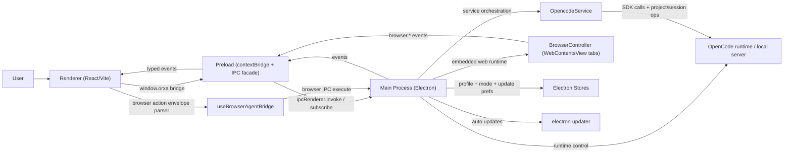

# Architecture

Opencode Orxa is an Electron app with a strict process split.

## Process boundaries

- `electron/main.ts`: BrowserWindow lifecycle, IPC handlers, runtime bridge, updater integration.
- `electron/preload.ts`: safe, typed API surface exposed as `window.orxa`.
- `src/*`: UI state and rendering only; no direct Node APIs.
- `electron/services/browser-controller.ts`: persistent in-app browser controller (tabs, bounds, history, agent actions, security guards).

## IPC contract

- Centralized in `shared/ipc.ts`.
- Renderer only talks through typed channels.
- High-risk inputs (`sendPrompt`, runtime profile save, config patch) are schema-validated in main.
- Browser automation IPC (`orxa:browser:*`) is sender-validated in main and payload-validated per action.

## Runtime lifecycle

1. App starts, window created.
2. Main restores mode/profile state and optionally runs Orxa bootstrap.
3. Renderer boots and hydrates workspace/project/session state through IPC.
4. Event stream (`orxa:events`) pushes runtime, project, terminal, and updater telemetry updates.

## Browser lifecycle

1. Main initializes `BrowserController` with a persistent Electron partition (`persist:orxa-browser`).
2. Renderer opens browser pane and sends viewport bounds to main.
3. Main attaches active `WebContentsView` tab to the main window `contentView` and keeps tab bounds synced.
4. Browser state/history/action results are emitted as typed `browser.*` events on the existing `orxa:events` stream.
5. Agent browser actions flow through structured envelopes parsed in renderer, executed via browser IPC, and fed back into chat as machine result messages.

## Update lifecycle

1. Main initializes updater controller (`electron/services/auto-updater.ts`).
2. Controller loads persisted preferences (`auto check`, `release channel`).
3. Scheduled or manual checks run via GitHub Releases metadata.
4. On update available: prompt to download.
5. On download complete: prompt to restart and install.
